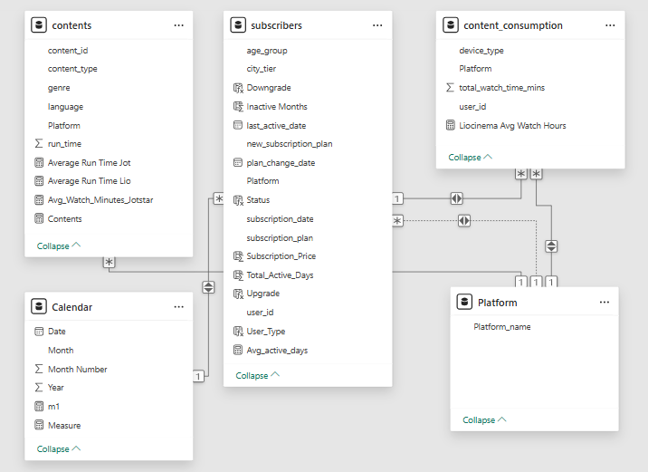
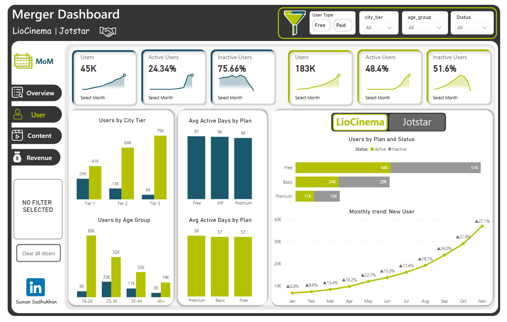
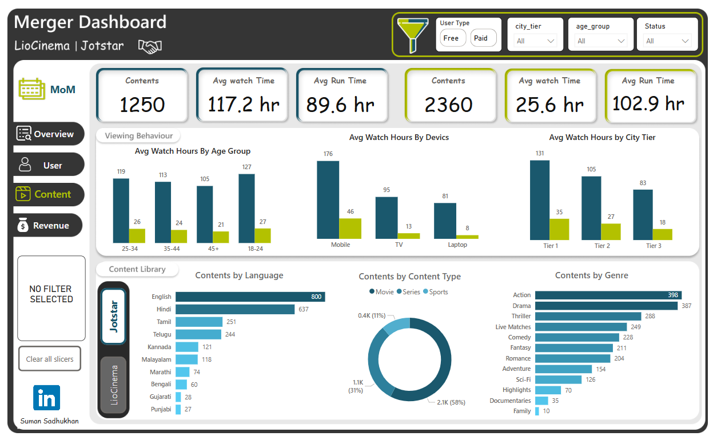
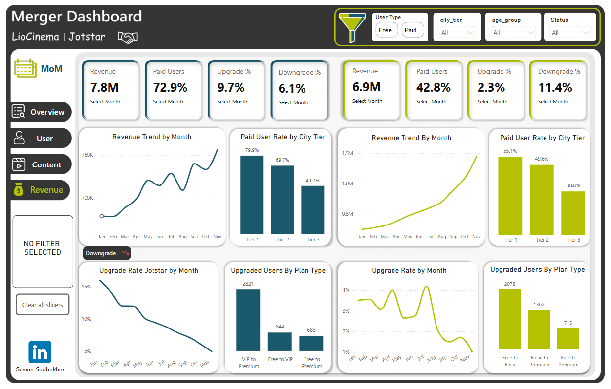
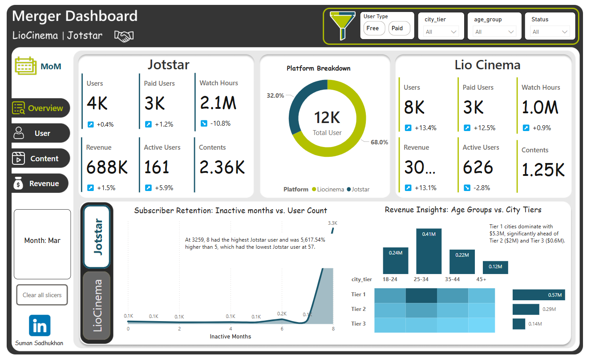
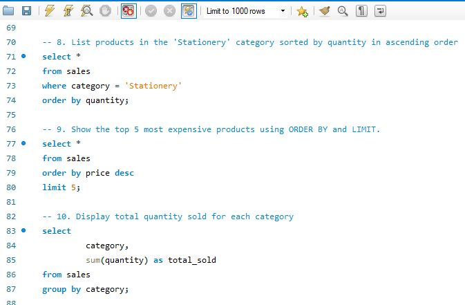

<h1 style="font-size:1.6em;"> Evereve — Driving Sustainable Sales Growth and Marketing Efficiency in Women’s Health through Product & Marketing Analytics</h1>

  <b><i><u> 🔴 Product & Marketing Research Analyst initiative | ⭕ FMCG ⭕ Women’s Health & Personal Care ⭕ Feminine Hygiene ⭕ B2C</u></i></b>

> 🌍 **Evereve Company Vision (Public & Strategic Context)**  
> Evereve positions itself as a women’s hygiene and personal care brand focused on improving access to safe, reliable, and high-quality feminine hygiene products, while promoting awareness, dignity, and well-being for women across different socio-economic segments.

🔹 [Scope](#scope): End-to-end product & marketing analytics project
🔹 [Data](#data): CRM + ERP + Web | Multi-million records
🔹 [Stakeholders](#stakeholders): Business, Sales, Marketing leadership
🔹 [Role](#role): Product & Marketing Data Analyst
🔹 [Method](#method): Pre–Post analysis, segmentation, trend analysis
🔹 [Visualization](#visualization): Executive dashboards and storytelling
🔹 [Forecast](#forecast): Trend-based projections and scenario analysis
🔹 [Workflow](#workflow): End-to-end analytics pipeline
🔹 [Code](#code): SQL & Python scripts

## ✔ **Scope & Responsibilities:**
- Structured the business problem and defined key success metrics
- Identified and quantified drivers of underperformance and growth
- Designed and executed the pre–post impact evaluation framework
- Synthesized insights into clear, actionable business recommendations

  ----

## ❓ Leadership Questions Raised by Stakeholders |(Sales Head & CMO)

| Leadership Question |
|----------------------|
| 🔴 Where exactly are we underperforming across regions, and what are the primary drivers of that underperformance? |
| 🔴 Did the targeted discounts and festival campaigns deliver sustainable improvement, or only short-term uplift? |

### 🔁 My Counter-Question (As Marketing Analyst Perspective)

🔶 Are we optimizing primarily for short-term sales growth or for long-term customer retention and brand trust — and should our strategy differ based on that objective?
---
## 🎯 Problem Statement

The Indian OTT landscape is fiercely competitive, characterized by:

- Intense rivalry among domestic and international players 🌍  
- Rapidly evolving consumer preferences 📱  
- The constant need for innovation in content and technology 💡  

This project addresses the strategic imperative for consolidation. By analyzing the potential merger of **LioCinema** and **Jotstar**, we aim to:

- Identify key synergies 🤝  
- Unlock growth opportunities 🌱  
- Navigate market challenges effectively 🧭  

---

## 📺 Live Dashboard

🔗 **[Explore Interactive Power BI Dashboard](PASTE_YOUR_LINK_HERE)**

----
## ✨ Overview

This project delivers a comprehensive data-driven analysis of the strategic merger between **LioCinema** and **Jotstar**, two prominent Over-The-Top (OTT) streaming platforms in India. 🚀  

The core objective is to provide actionable insights and strategic recommendations that pave the way for a successful merger, positioning the combined entity as the undisputed leader in the dynamic Indian OTT market. 🏆  

---

## 📝 Objectives

- **Evaluate Operational Synergies:** Assess the potential for combining operations and resources to achieve greater efficiency ⚙️  
- **Identify Growth Opportunities:** Pinpoint areas for market expansion, new user acquisition, and revenue diversification 📈  
- **Assess Financial Implications:** Analyze the financial viability of the merger, including revenue projections, cost savings, and investment requirements 💰  
- **Recommend Integration Strategies:** Develop data-backed recommendations for a seamless and successful integration of the two platforms 🗺️  

---

## 💾 Data

The analysis is powered by a rich dataset comprising:

- **Internal Platform Metrics:** Data on user activity, content consumption, and platform performance 📊  
- **Subscriber Data:** Demographic information, subscription details, and user behavior patterns 👥  
- **Content Library Records:** Metadata on content titles, genres, languages, and performance metrics 🎬  

### Data Preparation Highlights:

- **ETL-processed:** Extracted, transformed, and loaded data from source systems 🔄  
- **Appended:** Combined data from two MySQL databases 🗄️  
- **Resulting Dataset:** Consolidated 228,000+ user records 💯  

---

## 🛠️ Data Model

The following data model consolidates and relates all critical information from both platforms:

### Key Components:

- **User Table:** Demographic, subscription, and behavior data  
- **Content Table:** Metadata on content titles, genre, performance  
- **Revenue Table:** User payments, subscription upgrades/downgrades, revenue  
- **Activity Table:** Logs of content consumption patterns  
- **Plan Table:** Subscription plan types and pricing  

---

## 🔍 Analysis and Insights

### 👥 User Analysis

- User demographics and activity trends  
- Churn rate and inactivity patterns  
- Plan-wise engagement analysis

---

### 🎞️ Content Analysis

- Library size, language diversity, genre distribution  
- Content consumption patterns across platforms  
- Performance of popular titles

## 💰 Revenue Analysis

- Subscription upgrade/downgrade patterns  
- Monthly recurring revenue trends  
- Pricing model effectiveness

---

## 📊 Overall Platform Overview

- Unified summary of performance metrics  
- User growth, retention, and monetization combined
  

---

## 📌 Key Insights

- **User Engagement:** Jotstar users average 117.2 hours of watch time vs. LioCinema’s 25.6 hours ⏱️  
- **Monetization:** Jotstar has a 72.9% upgrade rate, LioCinema trails at 42.8% 💸  
- **Retention Challenge:** 75.66% of Jotstar users are inactive — a prime focus for retention strategy 😴  

---

## 💡 Recommendations

### 🎬 Content Strategy
- **Diversified Portfolio:** Blend both platforms' content strengths  
- **Exclusive Originals & Early Access:** Boost loyalty and differentiation  

---

### 📣 Marketing Strategy
- **Data-Driven Campaigns:** Personalized marketing based on user segments  
- **Regional Influencer Collaborations:** Boost local engagement  

---

### 💰 Pricing Strategy
- **Flexible Tiers:** Introduce more granular subscription options  
- **Introductory Offers:** Improve conversion from free to paid users  

---

### ⚙️ Technology Strategy
- **Unified Data Platform:** Merge datasets for a 360° customer view  
- **AI-Based Recommendations:** Improve content discovery & personalization  

---

## 📈 Dashboard

Interactive Power BI dashboards provide visualization of key metrics and KPIs, enabling stakeholders to:

- Explore data trends 🔍  
- Monitor performance 📉  
- Make informed decisions 🧠  

---

## 🚀 Conclusion

This project delivers actionable intelligence and strategic guidance to facilitate the successful merger of **LioCinema** and **Jotstar**.

By embracing a data-centric approach, the combined entity can:

- Optimize operations ⚙️  
- Elevate user experience ✨  
- Achieve a dominant position in the thriving Indian OTT market 🏆  

---
---
-----

## 📌 Business Summary

| WHAT | WHY |
|------|------|
| 🧠 **Business Problem** | Sales in Karnataka and Delhi were lagging behind other major states, indicating uneven regional performance. |
| 🔍 **Insight** | Lower conversion and seasonal engagement were observed compared to western and southern markets. |
| 🎯 **Action** | Targeted discounts and festival-led campaigns (Diwali & holiday offers) were rolled out in Karnataka and Delhi. |
| ⏱ **Timeline** | Campaigns were active for 8 months. |
| 📈 **Impact** | Delhi sales increased by 21% and Karnataka by 28% compared to the pre-campaign baseline. |
| 💡 **Outcome** | Sales distribution became more balanced, improving overall performance across regions. |

-----

<h2>📊 Before vs After Campaign Impact</h2>
<table>
  <tr>
    <td align="center"><b>Before Campaign</b></td>
    <td align="center"><b>After Campaign</b></td>
  </tr>
  <tr>
    <td></td>
    <td></td>
  </tr>
</table>

----

---
## **⚙️ End-to-End Analytics Workflow — (As per the Company Need and Stakeholder Ask)**

| *Step* | *Layer / Phase* | *Description* | *Tools & Techniques* |
|--------|------------------|---------------|----------------------|
| 1 | Data Ingestion | Ingested data from CRM, ERP, web events, APIs, and partners | APIs, Batch Jobs, Cloud Connectors |
| 2 | Bronze Layer | Stored raw data in the data lake | AWS S3 / Azure Data Lake |
| 3 | Data Quality & Validation | Applied schema validation, null checks, and deduplication | SQL (JOINs, GROUP BY, CTEs, Window Functions), Python |
| 4 | Silver Layer | Created cleaned and standardized analytical tables | SQL, Python |
| 5 | EDA & Statistical Analysis | Performed pattern discovery and hypothesis testing | SQL, Python (NumPy, Pandas), Statistics |
| 6 | Gold Layer | Built business-ready aggregates and KPIs | SQL, Power BI |
| 7 | Modeling / Segmentation | Built models and segments when needed | Python (scikit-learn), SQL |
| 8 | Visualization & Storytelling | Designed dashboards and narratives | Python (Matplotlib, Seaborn, Plotly), Power BI (DAX, Power Query) |
| 9 | Governance & Compliance | Ensured privacy, security, and access control | IAM, Data Policies |
|10 | Business Delivery | Reviewed insights with stakeholders and iterated | Presentations, Reviews |
|11 | Stakeholder Communication | Communicated insights clearly, aligned teams, and supported decision-making | Storytelling, Executive Summaries |
|12 | Decision & Impact Review | Measured outcomes, validated assumptions, and refined strategy | KPI Tracking, Post-Analysis |
|13 | Continuous Improvement | Incorporated feedback and continuously improved models and processes | Retrospectives, Iteration |
## ** OVERVIEW OF SQL SCRIPT-**

**Team Size:** 2  
**Author:** Priyanka De  
**Proflie** - [Priyanka De](https://www.linkedin.com/in/priyanka-de-711555289/)
