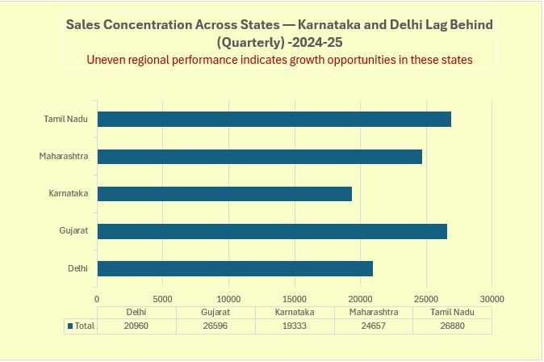
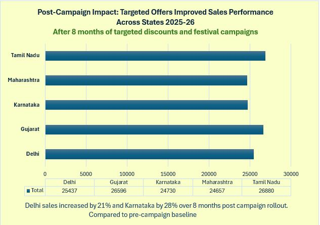
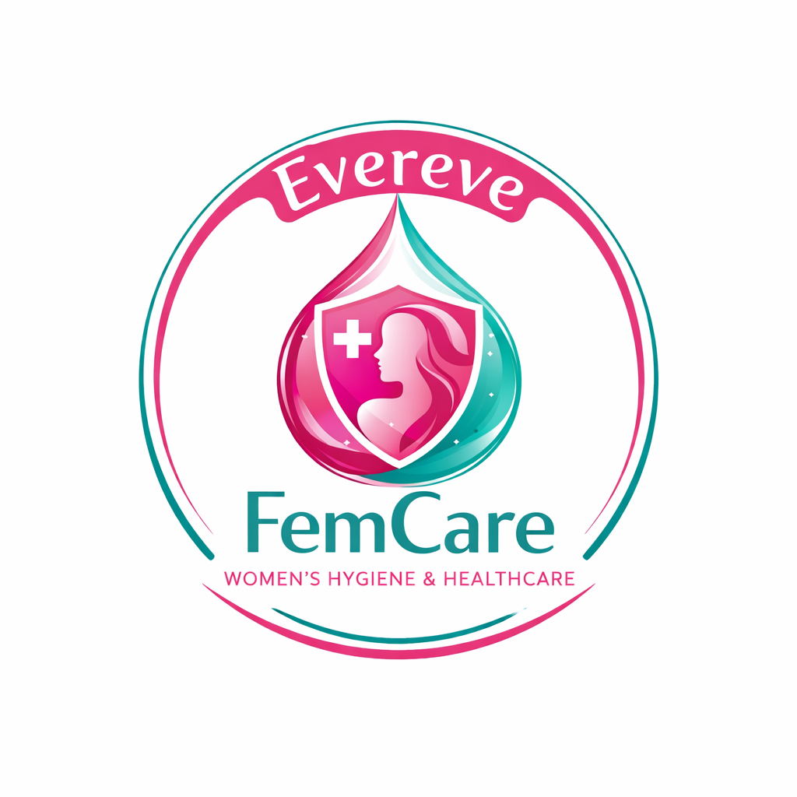

<h1 style="font-size:1.6em;"> Evereve — ⭐End to End Full Stack Analyst Project | Data ingestion- ETL-Pipeline-Automation | Driving Sustainable Sales Growth and Marketing Efficiency in Women’s Health through Product & Marketing Analytics</h1>

  <b><i><u> 🔴 Product & Marketing Research Analyst initiative | ⭕ FMCG ⭕ Women’s Health & Personal Care ⭕ Feminine Hygiene ⭕ B2C</u></i></b>

🌍 <b>Evereve Company Vision (Public & Strategic Context)</b> 
Evereve positions itself as a women’s hygiene and personal care brand focused on improving access to safe, reliable, and high-quality feminine hygiene products, while promoting awareness, dignity, and well-being for women across different socio-economic segments.

---
🔹 [Scope](#scope): End-to-end product & marketing analytics project
🔹 [Data](#data): CRM + ERP + Web | Multi-million records
🔹 [Stakeholders](#stakeholders): Business, Sales, Marketing leadership
🔹 [Role](#role): Product & Marketing Data Analyst
🔹 [Method](#method): Pre–Post analysis, segmentation, trend analysis
🔹 [Visualization](#visualization): Executive dashboards and storytelling
🔹 [Forecast](#forecast): Trend-based projections and scenario analysis
🔹 [Workflow](#workflow): End-to-end analytics pipeline
🔹 [Code](#code): SQL & Python scripts |

----

## 📌 ETL Pipeline - Data Ingestion flowchart

----
## ✔ **Scope & Responsibilities:**
- Structured the business problem and defined key success metrics
- Identified and quantified drivers of underperformance and growth
- Designed and executed the pre–post impact evaluation framework
- Synthesized insights into clear, actionable business recommendations

  ----

## ❓ Leadership Questions Raised by Stakeholders |(Sales Head & CMO)

| Leadership Question |
|----------------------|
| 🔴 Where exactly are we underperforming across regions, and what are the primary drivers of that underperformance? |
| 🔴 Did the targeted discounts and festival campaigns deliver sustainable improvement, or only short-term uplift? |

# 🔁 My Counter-Question (As Marketing Analyst Perspective)
  🔶 Are we optimizing primarily for short-term sales growth or for long-term customer retention and brand trust — and should our strategy differ based on that objective?
----

## 📌 Business Summary

| WHAT | WHY |
|------|------|
| 🧠 **Business Problem** | Sales in Karnataka and Delhi were lagging behind other major states, indicating uneven regional performance. |
| 🔍 **Insight** | Lower conversion and seasonal engagement were observed compared to western and southern markets. |
| 🎯 **Action** | Targeted discounts and festival-led campaigns (Diwali & holiday offers) were rolled out in Karnataka and Delhi. |
| ⏱ **Timeline** | Campaigns were active for 8 months. |
| 📈 **Impact** | Delhi sales increased by 21% and Karnataka by 28% compared to the pre-campaign baseline. |
| 💡 **Outcome** | Sales distribution became more balanced, improving overall performance across regions. |

-----

<h2>📊 Before vs After Campaign Impact</h2>
<table>
  <tr>
    <td align="center"><b>Before Campaign</b></td>
    <td align="center"><b>After Campaign</b></td>
  </tr>
  <tr>
    <td></td>
    <td></td>
  </tr>
</table>

----

---
## **⚙️ End-to-End Analytics Workflow — (As per the Company Need and Stakeholder Ask)**

| *Step* | *Layer / Phase* | *Description* | *Tools & Techniques* |
|--------|------------------|---------------|----------------------|
| 1 | Data Ingestion | Ingested data from CRM, ERP, web events, APIs, and partners | APIs, Batch Jobs, Cloud Connectors |
| 2 | Bronze Layer | Stored raw data in the data lake | AWS S3 / Azure Data Lake |
| 3 | Data Quality & Validation | Applied schema validation, null checks, and deduplication | SQL (JOINs, GROUP BY, CTEs, Window Functions), Python |
| 4 | Silver Layer | Created cleaned and standardized analytical tables | SQL, Python |
| 5 | EDA & Statistical Analysis | Performed pattern discovery and hypothesis testing | SQL, Python (NumPy, Pandas), Statistics |
| 6 | Gold Layer | Built business-ready aggregates and KPIs | SQL, Power BI |
| 7 | Modeling / Segmentation | Built models and segments when needed | Python (scikit-learn), SQL |
| 8 | Visualization & Storytelling | Designed dashboards and narratives | Python (Matplotlib, Seaborn, Plotly), Power BI (DAX, Power Query) |
| 9 | Governance & Compliance | Ensured privacy, security, and access control | IAM, Data Policies |
|10 | Business Delivery | Reviewed insights with stakeholders and iterated | Presentations, Reviews |
|11 | Stakeholder Communication | Communicated insights clearly, aligned teams, and supported decision-making | Storytelling, Executive Summaries |
|12 | Decision & Impact Review | Measured outcomes, validated assumptions, and refined strategy | KPI Tracking, Post-Analysis |
|13 | Continuous Improvement | Incorporated feedback and continuously improved models and processes | Retrospectives, Iteration |

**Team Size:** 2  
**Author:** Priyanka De  
**Proflie** - [Priyanka De](https://www.linkedin.com/in/priyanka-de-711555289/)

## 📌 Slides Preview (Last 3)

  
  
  

